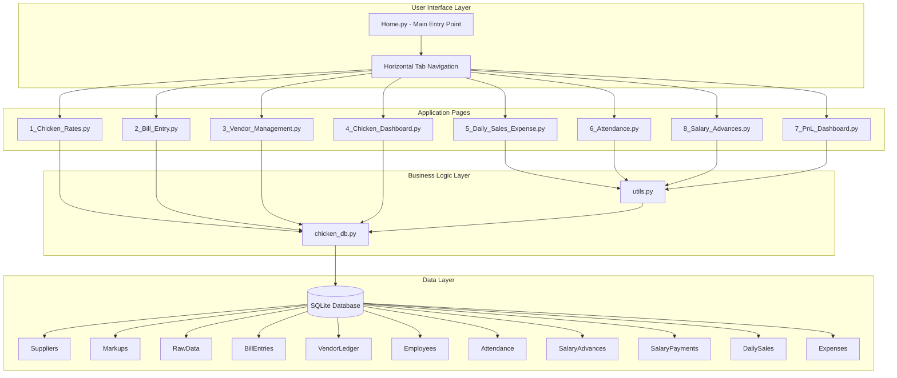
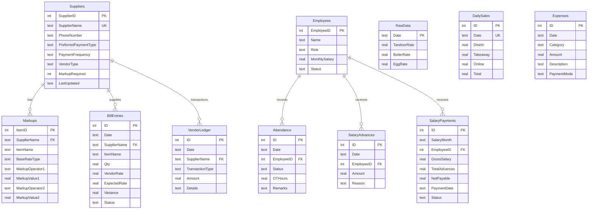
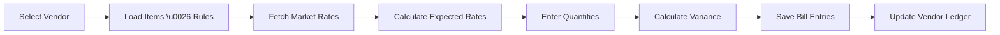
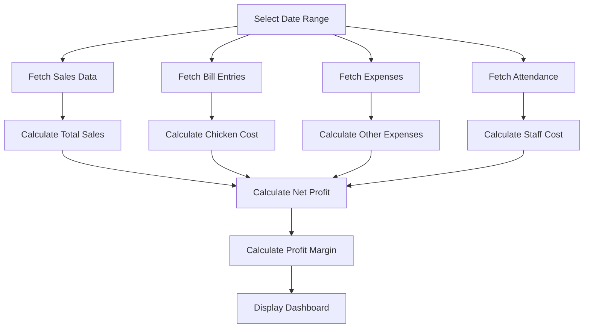

# Zohra Restaurant Management System

## 📋 Table of Contents
- [Overview](#overview)
- [System Architecture](#system-architecture)
- [Database Schema](#database-schema)
- [Module Documentation](#module-documentation)
- [Data Flow](#data-flow)
- [Installation \u0026 Setup](#installation--setup)
- [Usage Guide](#usage-guide)
- [Testing](#testing)

---

## Overview

**Zohra Restaurant Management System** is a comprehensive Streamlit-based web application designed to manage all aspects of a restaurant's operations, with a special focus on chicken/poultry procurement, vendor management, employee attendance, and financial tracking.

### Key Features

#### 🐔 Chicken Management
- **Daily Rate Tracking**: Record market rates for Tandoor, Boiler, and Egg chicken
- **Bill Entry**: Track purchases with automatic variance calculation against expected rates
- **Vendor Management**: Manage suppliers with custom markup rules
- **Dashboard**: Visualize rate trends and vendor outstanding dues

#### 💼 Restaurant Operations
- **Sales \u0026 Expenses**: Track daily sales (Dine-in, Takeaway, Online) and categorized expenses
- **Attendance**: Manage employee attendance with overtime tracking
- **Salary \u0026 Advances**: Calculate salaries with 28-day payment delay rule and advance management
- **P\u0026L Dashboard**: Comprehensive profit \u0026 loss analysis with cost breakdowns

### Technology Stack
- **Frontend**: Streamlit (Python web framework)
- **Database**: SQLite
- **Data Processing**: Pandas, NumPy
- **Styling**: Custom CSS for enhanced UI/UX

---

## System Architecture



### Architecture Layers

1. **User Interface Layer**: Streamlit-based web interface with horizontal tab navigation
2. **Application Pages**: Individual modules for specific business functions
3. **Business Logic Layer**: Core database operations and utility functions
4. **Data Layer**: SQLite database with normalized schema

---

## Database Schema

### Entity Relationship Diagram



### Table Descriptions

#### Core Tables

**Suppliers**
- Stores vendor/supplier information
- Supports different vendor types (Chicken, Other)
- Tracks markup requirements and payment preferences

**Markups**
- Defines pricing rules for each supplier's items
- Supports dynamic calculations with operators (+, -, *, /)
- Allows chained operations (e.g., base + 10 * 1.1)

**RawData**
- Daily market rates for chicken types
- Primary reference for expected rate calculations

**BillEntries**
- Records all purchase transactions
- Calculates variance between vendor rate and expected rate
- Flags high-variance transactions

**VendorLedger**
- Tracks all financial transactions with vendors
- Includes bills and payments
- Used for calculating outstanding dues

#### Employee Management Tables

**Employees**
- Employee master data
- Includes salary information and status

**Attendance**
- Daily attendance records
- Tracks overtime hours
- Unique constraint on Date + EmployeeID

**SalaryAdvances**
- Records salary advances given to employees
- Deducted from monthly salary calculations

**SalaryPayments**
- Monthly salary calculations
- Implements 28-day payment delay rule
- Tracks payment status

#### Financial Tables

**DailySales**
- Daily sales by channel (Dine-in, Takeaway, Online)
- Unique constraint on Date

**Expenses**
- Categorized daily expenses
- Supports multiple payment modes

---

## Module Documentation

### 1. Home.py - Main Application Entry

**Purpose**: Application entry point with horizontal tab navigation

**Key Features**:
- Streamlit page configuration
- Horizontal tab-based navigation
- Dynamic page loading using `exec()`
- Custom CSS for dark theme optimization

**Navigation Structure**:
```python
Tabs:
├── 🏠 Home (Welcome screen)
├── 📊 Chicken Rates
├── 🧾 Bill Entry
├── 👥 Vendors
├── 📈 Chicken Dashboard
├── 💰 Sales \u0026 Expenses
├── 👤 Attendance
├── 💵 Salary \u0026 Advances
└── 💼 P\u0026L Dashboard
```

---

### 2. chicken_db.py - Database Layer

**Purpose**: Core database operations and business logic

**Key Functions**:

#### Database Initialization
```python
initialize_db()
```
- Creates all required tables
- Handles schema migrations
- Idempotent (safe to call multiple times)

#### Vendor Operations
```python
fetch_suppliers_and_items() → (list, dict)
fetch_vendor_type(vendor_name) → str
rename_vendor(old_name, new_name) → bool
delete_vendor_and_cleanup(supplier_id, supplier_name) → bool
insert_default_markups(vendor_name, default_rules) → bool
fetch_items_for_supplier(supplier_name) → list
```

#### Rate Calculations
```python
fetch_rate_and_rule(date, supplier_name, item_name) → (tuple, tuple)
calculate_expected_rate(raw_rates, rule) → float
```

**Rate Calculation Logic**:
1. Select base rate (Tandoor, Boiler, or Egg)
2. Apply first operation (Op1 with Val1)
3. Apply second operation if exists (Op2 with Val2)
4. Round to 2 decimal places

**Example**:
```python
raw_rates = (100, 90, 80)  # Tandoor, Boiler, Egg
rule = ('TandoorRate', '+', 10, '*', 1.1)
# Calculation: (100 + 10) * 1.1 = 121
```

#### Data Retrieval
```python
fetch_rate_history(limit=30) → list[tuple]
fetch_vendor_dues() → dict
```

---

### 3. utils.py - Utility Functions

**Purpose**: Shared utilities and styling

**Functions**:

```python
get_db_connection() → sqlite3.Connection
```
- Returns database connection
- Uses `chicken_db.DB_NAME` for database path

```python
apply_styling()
```
- Applies custom CSS styling
- Implements Inter font family
- Provides consistent UI theme
- Enhances form and table styling

---

### 4. Page Modules

#### 1_Chicken_Rates.py

**Purpose**: Daily market rate entry

**Workflow**:
1. Select date
2. Load existing rates (if any)
3. Enter/update Tandoor, Boiler, Egg rates
4. Save to `RawData` table
5. Clear cached rate history

**Data Flow**:
```
User Input → Form Validation → RawData Table → Cache Clear
```

---

#### 2_Bill_Entry.py

**Purpose**: Record daily purchases from vendors

**Workflow**:
1. Select date and vendor
2. Load vendor's items and markup rules
3. Fetch market rates for the date
4. Calculate expected rates for each item
5. Enter quantities and vendor rates
6. Calculate variance (Vendor Rate - Expected Rate)
7. Flag high variance items (|variance| \u003e threshold)
8. Save to `BillEntries` and update `VendorLedger`

**Data Flow**:


**Variance Calculation**:
```python
variance = vendor_rate - expected_rate
status = 'High' if abs(variance) \u003e threshold else 'Okay'
```

---

#### 3_Vendor_Management.py

**Purpose**: Manage vendors and markup rules

**Features**:
- **Vendor CRUD**: Add, edit, delete vendors
- **Markup Rules**: Define pricing rules per item
- **Vendor Ledger**: View transaction history
- **Payment Recording**: Record vendor payments
- **Due Calculation**: Calculate outstanding balances

**Markup Rule Structure**:
```
Item → Base Rate Type → Operator1 → Value1 → Operator2 → Value2
```

**Example Markup Rules**:
```
Boneless → TandoorRate → + → 95 → None → None
Full Leg → TandoorRate → + → 18 → * → 1.05
```

---

#### 4_Chicken_Dashboard.py

**Purpose**: Visualize chicken rate trends and vendor dues

**Visualizations**:
- Rate history line chart (last 30 days)
- Vendor dues bar chart
- Summary metrics

---

#### 5_Daily_Sales_Expense.py

**Purpose**: Track daily sales and expenses

**Features**:

**Sales Entry**:
- Dine-in sales
- Takeaway sales
- Online sales
- Auto-calculate total

**Expense Entry**:
- Grid-based bulk entry
- Categorized expenses (Rent, Electricity, Gas, Salaries, etc.)
- Multiple payment modes
- Dynamic row addition

**Summary View**:
- Date range filtering
- Sales and expense trends
- Total calculations

---

#### 6_Attendance.py

**Purpose**: Employee attendance management

**Features**:

**Daily Attendance**:
- Grid-based entry for all employees
- Status: Present/Absent/Leave
- Overtime hours tracking
- Remarks field
- Summary metrics (Present count, Absent count, Total OT)

**Employee Master**:
- Add/edit/delete employees
- Role and salary management
- Status tracking (Active/Inactive)

**Reports**:
- Date range filtering
- Employee-wise attendance summary
- Present days and OT hours aggregation

---

#### 8_Salary_Advances.py

**Purpose**: Salary calculation and advance management

**Features**:

**Advance Entry**:
- Record salary advances
- Track advance reasons
- View recent advances

**Salary Calculation**:
- Select salary month
- Auto-calculate based on attendance
- Deduct advances
- Apply 28-day payment delay rule
- Save to `SalaryPayments` table

**Salary Calculation Logic**:
```python
gross_salary = monthly_salary  # Full salary
total_advances = SUM(advances for the month)
net_payable = gross_salary - total_advances
payment_date = month_end + 28 days
```

**Payment History**:
- View all salary payments
- Mark salaries as paid
- Filter by month and employee

---

#### 7_PnL_Dashboard.py

**Purpose**: Comprehensive profit \u0026 loss analysis

**Calculations**:

**Revenue**:
```sql
Total Sales = SUM(DailySales.Total)
```

**Costs**:
```sql
Chicken Cost = SUM(BillEntries.Qty * VendorRate)
Other Expenses = SUM(Expenses.Amount)
Staff Cost = SUM((MonthlySalary / 30) * PresentDays)
Total Cost = Chicken Cost + Other Expenses + Staff Cost
```

**Profit**:
```sql
Net Profit = Total Sales - Total Cost
Profit Margin = (Net Profit / Total Sales) * 100
```

**Visualizations**:
- Key metrics (Sales, Costs, Profit, Margin)
- P\u0026L statement table
- Cost breakdown by category
- Expense details chart
- Sales trend line chart

---

## Data Flow

### Bill Entry Workflow

```mermaid
sequenceDiagram
    participant User
    participant BillEntry
    participant ChickenDB
    participant Database
    
    User-\u003e\u003eBillEntry: Select Date \u0026 Vendor
    BillEntry-\u003e\u003eChickenDB: fetch_items_for_supplier()
    ChickenDB-\u003e\u003eDatabase: Query Markups
    Database--\u003e\u003eChickenDB: Return Items
    ChickenDB--\u003e\u003eBillEntry: Items List
    
    BillEntry-\u003e\u003eChickenDB: fetch_rate_and_rule()
    ChickenDB-\u003e\u003eDatabase: Query RawData \u0026 Markups
    Database--\u003e\u003eChickenDB: Rates \u0026 Rules
    ChickenDB--\u003e\u003eBillEntry: Raw Rates \u0026 Rule
    
    BillEntry-\u003e\u003eChickenDB: calculate_expected_rate()
    ChickenDB--\u003e\u003eBillEntry: Expected Rate
    
    User-\u003e\u003eBillEntry: Enter Qty \u0026 Vendor Rate
    BillEntry-\u003e\u003eBillEntry: Calculate Variance
    
    User-\u003e\u003eBillEntry: Save Bill
    BillEntry-\u003e\u003eDatabase: Insert BillEntries
    BillEntry-\u003e\u003eDatabase: Insert VendorLedger
    Database--\u003e\u003eBillEntry: Success
    BillEntry--\u003e\u003eUser: Confirmation
```

### Salary Calculation Workflow

```mermaid
sequenceDiagram
    participant User
    participant SalaryModule
    participant Database
    
    User-\u003e\u003eSalaryModule: Select Month
    User-\u003e\u003eSalaryModule: Click Calculate
    
    SalaryModule-\u003e\u003eDatabase: Fetch Active Employees
    Database--\u003e\u003eSalaryModule: Employee List
    
    loop For Each Employee
        SalaryModule-\u003e\u003eDatabase: Count Present Days
        Database--\u003e\u003eSalaryModule: Present Days
        
        SalaryModule-\u003e\u003eDatabase: Sum Advances
        Database--\u003e\u003eSalaryModule: Total Advances
        
        SalaryModule-\u003e\u003eSalaryModule: Calculate Net Payable
        SalaryModule-\u003e\u003eSalaryModule: Calculate Payment Date (+28 days)
        
        SalaryModule-\u003e\u003eDatabase: Insert SalaryPayments
    end
    
    SalaryModule--\u003e\u003eUser: Display Results
```

### P\u0026L Calculation Workflow



---

## Installation \u0026 Setup

### Prerequisites
- Python 3.8 or higher
- pip (Python package manager)

### Installation Steps

1. **Clone the repository**:
   ```bash
   git clone \u003crepository-url\u003e
   cd management_app
   ```

2. **Create virtual environment**:
   ```bash
   python -m venv venv
   ```

3. **Activate virtual environment**:
   ```bash
   # Linux/Mac
   source venv/bin/activate
   
   # Windows
   venv\Scripts\activate
   ```

4. **Install dependencies**:
   ```bash
   pip install -r requirements.txt
   ```

5. **Initialize database**:
   ```bash
   python -c "import chicken_db; chicken_db.initialize_db()"
   ```

6. **Run the application**:
   ```bash
   streamlit run Home.py
   ```

7. **Access the application**:
   Open your browser and navigate to `http://localhost:8501`

---

## Usage Guide

### First-Time Setup

1. **Add Employees** (Attendance tab → Employee Master)
   - Add all restaurant employees
   - Set monthly salaries
   - Mark as Active

2. **Add Vendors** (Vendors tab)
   - Add chicken suppliers
   - Set vendor type and payment preferences
   - Define markup rules for each item

3. **Enter Daily Rates** (Chicken Rates tab)
   - Enter market rates daily
   - Required for variance calculations

### Daily Operations

**Morning Routine**:
1. Enter today's chicken rates
2. Mark employee attendance
3. Record any salary advances

**After Purchases**:
1. Enter bill entries for each vendor
2. Review variance alerts
3. Record any vendor payments

**End of Day**:
1. Enter sales (Dine-in, Takeaway, Online)
2. Record expenses

**Month-End**:
1. Calculate salaries
2. Review P\u0026L dashboard
3. Generate reports

---

## Testing

### Running Tests

**Run all tests**:
```bash
python tests/run_tests.py
```

**Run specific test module**:
```bash
python -m unittest tests.test_chicken_db
python -m unittest tests.test_utils
python -m unittest tests.test_business_logic
```

**With pytest** (if installed):
```bash
pytest tests/ -v
pytest tests/ --cov=. --cov-report=html
```

### Test Coverage

The test suite includes:
- ✅ 26 unit tests
- ✅ Database operations
- ✅ Vendor management
- ✅ Rate calculations
- ✅ Business logic workflows
- ✅ Data integrity

See [tests/README.md](tests/README.md) for detailed test documentation.

---

## Project Structure

```
management_app/
├── Home.py                      # Main entry point
├── pages/                       # Application modules
│   ├── 1_Chicken_Rates.py      # Daily rate entry
│   ├── 2_Bill_Entry.py         # Purchase recording
│   ├── 3_Vendor_Management.py  # Vendor \u0026 markup management
│   ├── 4_Chicken_Dashboard.py  # Rate trends visualization
│   ├── 5_Daily_Sales_Expense.py # Sales \u0026 expense tracking
│   ├── 6_Attendance.py         # Employee attendance
│   ├── 7_PnL_Dashboard.py      # P\u0026L analysis
│   └── 8_Salary_Advances.py    # Salary calculations
├── chicken_db.py               # Database layer
├── utils.py                    # Shared utilities
├── tests/                      # Unit tests
│   ├── test_chicken_db.py
│   ├── test_utils.py
│   ├── test_business_logic.py
│   ├── test_vendor_flow.py
│   └── run_tests.py
├── docs/                       # Documentation
├── .streamlit/                 # Streamlit config
├── venv/                       # Virtual environment
├── chicken_tracker.db          # SQLite database
├── requirements.txt            # Python dependencies
├── README.md                   # This file
└── CHANGELOG.md               # Version history
```

---

## Contributing

1. Fork the repository
2. Create a feature branch
3. Make your changes
4. Add tests for new functionality
5. Ensure all tests pass
6. Submit a pull request

---

## License

[Add your license information here]

---

## Support

For issues, questions, or contributions, please contact [your contact information].
